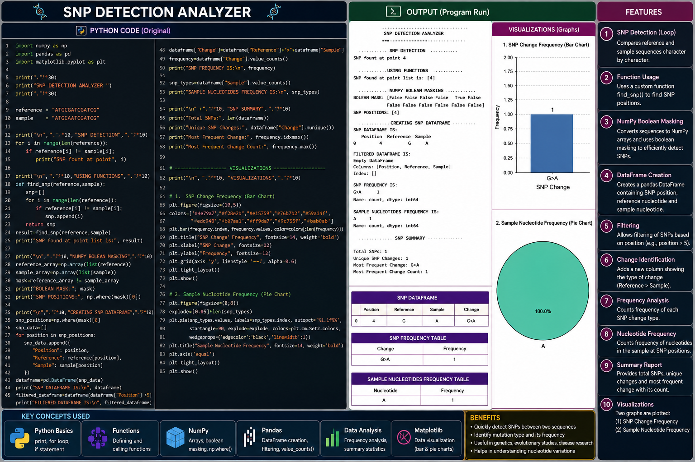

# 🧬 SNP Detection Analyzer

### **Computational Biology Project | DNA Sequence Comparison | SNP Detection | NumPy | Pandas | Data Visualization**

The **SNP Detection Analyzer** is a Python-based computational biology project designed to identify **Single Nucleotide Polymorphisms (SNPs)** by comparing a reference DNA sequence with a sample DNA sequence.

The project combines **biological sequence analysis with Python programming and data science techniques** to detect nucleotide-level differences, locate SNP positions, organize the results into a Pandas DataFrame, analyze SNP frequencies, and visualize the detected variations.

---

## 🔬 What is an SNP?

A **Single Nucleotide Polymorphism (SNP)** is a variation at a single nucleotide position in a DNA sequence.

For example:

```text
Reference: ATGCGATCGATCG
Sample:    ATGCAATCGATCG
```

At one position:

```text
Reference → G
Sample    → A
```

Therefore, the analyzer identifies this as a:

```text
G → A
```

SNP change.

SNPs are important in computational biology because nucleotide-level variations can be studied to understand **genetic diversity, population variation, disease-associated variants, and differences between biological samples**.

---

# 🎯 Project Objective

The main objective of this project is to build a simple computational workflow that can:

* Compare two DNA sequences
* Detect nucleotide differences
* Identify SNP positions
* Store SNP information in a structured DataFrame
* Filter SNP results
* Determine SNP change types
* Calculate SNP frequencies
* Analyze sample nucleotide frequencies
* Generate a final SNP summary
* Visualize SNP-related results

---

# 🚀 Key Features

### 🧬 DNA Sequence Comparison

Compares the reference and sample DNA sequences nucleotide by nucleotide.

### 🔄 Loop-Based SNP Detection

Uses Python loops to examine every nucleotide position.

### ⚙️ Function-Based Analysis

Uses a reusable function to detect and return SNP positions.

### 🔢 NumPy Array Processing

Converts DNA sequences into NumPy arrays for efficient comparison.

### 🎯 Boolean Masking

Uses NumPy Boolean masking to identify positions where the reference and sample sequences differ.

### 📍 SNP Position Detection

Uses:

```python
np.where(mask)[0]
```

to locate the positions containing SNPs.

### 📊 Pandas DataFrame

Stores detected SNP positions and nucleotide information in a structured table.

### 🔎 Data Filtering

Filters SNP records according to their positions.

### 🔀 SNP Change Analysis

Creates nucleotide changes such as:

```text
G>A
C>T
A>G
```

### 📈 Frequency Analysis

Uses Pandas `value_counts()` to determine how frequently each SNP change occurs.

### 📊 Data Visualization

Uses Matplotlib to create visual representations of SNP frequency and nucleotide frequency.

### 📝 SNP Summary

Generates important summary information such as:

* Total SNPs
* Unique SNP changes
* Most frequent SNP change
* Frequency of the most common SNP change

---

# 🧠 Python & Data Science Concepts Used

This project demonstrates a complete beginner-to-intermediate computational biology workflow:

```text
Strings
   ↓
Loops
   ↓
Functions
   ↓
NumPy Arrays
   ↓
Boolean Masking
   ↓
np.where()
   ↓
Counting
   ↓
Pandas DataFrame
   ↓
Filtering
   ↓
Frequency Analysis
   ↓
Summary Statistics
   ↓
Visualization
```

---

# 🧪 Technologies Used

| Technology     | Purpose                                              |
| -------------- | ---------------------------------------------------- |
| **Python**     | Core programming language                            |
| **NumPy**      | Array processing and Boolean masking                 |
| **Pandas**     | DataFrame creation, filtering and frequency analysis |
| **Matplotlib** | Data visualization                                   |

---

# 🔬 How the Analysis Works

## 1. Reference and Sample Sequences

The analyzer starts with two DNA sequences:

```python
reference = "ATGCGATCGATCG"
sample = "ATGCAATCGATCG"
```

The **reference sequence** represents the original/reference DNA sequence, while the **sample sequence** is compared against it.

---

## 2. Nucleotide-by-Nucleotide Comparison

A loop compares each nucleotide:

```python
for i in range(len(reference)):
    if reference[i] != sample[i]:
        print("SNP found at point", i)
```

Whenever the nucleotides are different, a possible SNP is detected.

---

## 3. Function-Based SNP Detection

The comparison logic is converted into a reusable function:

```python
def find_snp(reference, sample):
    snp = []

    for i in range(len(reference)):
        if reference[i] != sample[i]:
            snp.append(i)

    return snp
```

The function returns a list containing the positions where the two sequences differ.

This makes the analysis more **organized, reusable, and modular**.

---

# 🔢 NumPy Boolean Masking

The sequences are converted into NumPy arrays:

```python
reference_array = np.array(list(reference))
sample_array = np.array(list(sample))
```

The arrays can then be compared directly:

```python
mask = reference_array != sample_array
```

The result is a Boolean array:

```text
False False False False True False ...
```

Here:

* `False` → nucleotides are the same
* `True` → nucleotides are different

Therefore, `True` represents a detected SNP position.

---

# 📍 Finding SNP Positions

The project uses:

```python
np.where(mask)[0]
```

`np.where()` identifies the locations where the Boolean condition is `True`.

Therefore:

```python
np.where(mask)[0]
```

returns the positions of the detected SNPs.

---

# 📊 SNP DataFrame

The detected SNP information is converted into a Pandas DataFrame.

The table contains:

|     Position |      Reference      |       Sample      |
| -----------: | :-----------------: | :---------------: |
| SNP Position | Original nucleotide | Sample nucleotide |

This structured format makes the results easier to analyze and filter.

---

# 🔎 SNP Filtering

The project also demonstrates Pandas filtering:

```python
filtered_dataframe = dataframe[dataframe["Position"] > 5]
```

This allows specific SNP records to be selected according to their position.

Filtering is useful when working with larger genomic datasets where researchers may want to examine only specific genomic regions or positions.

---

# 🔀 SNP Change Identification

A new column is created to represent the nucleotide change:

```python
dataframe["Change"] = dataframe["Reference"] + ">" + dataframe["Sample"]
```

For example:

```text
G>A
C>T
A>G
```

This makes individual SNP substitutions easy to identify.

---

# 📈 SNP Frequency Analysis

The project uses:

```python
frequency = dataframe["Change"].value_counts()
```

This counts how frequently each SNP change occurs.

For example:

```text
G>A    5
C>T    3
A>G    2
```

This provides a simple overview of the most common nucleotide substitutions within the analyzed sample set.

---

# 🧪 Sample Nucleotide Frequency

The project also analyzes the frequency of nucleotides appearing in the sample SNP positions:

```python
snp_types = dataframe["Sample"].value_counts()
```

This helps summarize whether `A`, `T`, `G`, or `C` appears most frequently among the detected sample-side SNP nucleotides.

---

# 📊 Data Visualization

The project includes **two visualizations**.

## 1. SNP Change Frequency

A bar chart displays how frequently each SNP change occurs.

```python
plt.bar(frequency.index, frequency.values)

plt.title("SNP Change Frequency")
plt.xlabel("SNP Change")
plt.ylabel("Frequency")

plt.show()
```

This visualization makes it easier to compare different nucleotide substitutions.

---

## 2. Sample Nucleotide Frequency

A second visualization represents the frequency of sample nucleotides at SNP positions.

```python
plt.bar(snp_types.index, snp_types.values)

plt.title("Sample Nucleotide Frequency")
plt.xlabel("Nucleotide")
plt.ylabel("Frequency")

plt.show()
```

This provides a visual overview of nucleotide distribution within the detected SNPs.

---

# 📈 Visualization Preview

The project visualization combines the **SNP analysis results and graphical representation** into an easy-to-understand computational biology workflow.

**SNP Change Frequency**

The bar chart compares nucleotide substitutions such as `G>A`, `C>T`, etc.

**Sample Nucleotide Frequency**

The second chart shows the frequency of nucleotides found at detected SNP positions.

## 📊 Visualization



# 📝 Final SNP Summary

The analyzer generates a final summary containing:

```python
print("Total SNPs:", len(dataframe))
print("Unique SNP Changes:", dataframe["Change"].nunique())
print("Most Frequent Change:", frequency.idxmax())
print("Most Frequent Change Count:", frequency.max())
```

This provides a quick overview of the complete analysis.

The summary answers questions such as:

* How many SNPs were detected?
* How many unique SNP substitution types exist?
* Which SNP change is most common?
* How frequently does the most common change occur?

---

# 🌟 Benefits of the Project

### 🧬 Biological Understanding

Provides practical experience with DNA sequence variation and SNP identification.

### 💻 Programming Practice

Strengthens Python fundamentals through loops, strings, functions, conditions, and lists.

### 🔢 NumPy Skills

Demonstrates array conversion, Boolean masking, comparison, and position detection.

### 📊 Pandas Skills

Provides hands-on practice with DataFrames, filtering, columns, and frequency analysis.

### 📈 Data Visualization

Shows how biological data can be converted into understandable visual patterns.

### 🧠 Computational Biology Foundation

Demonstrates how programming and biological knowledge can be combined to analyze genomic information.

### 🚀 Future Expansion

The project can be extended to analyze multiple samples, larger sequences, multiple SNPs, and real genomic datasets.

---

# 🛠️ Installation

Make sure Python is installed on your system.

Install the required libraries:

```bash
pip install numpy pandas matplotlib
```

---

# ▶️ How to Run

Clone the repository:

```bash
git clone <your-repository-url>
```

Navigate to the project directory:

```bash
cd SNP-Detection-Analyzer
```

Run the Python file:

```bash
python SNP_Analyzer.py
```

The program will display:

* SNP detection results
* SNP positions
* Boolean mask
* SNP DataFrame
* Filtered DataFrame
* SNP frequency
* Sample nucleotide frequency
* Final SNP summary
* Visualization graphs

---

# 📁 Project Structure

```text
SNP-Detection-Analyzer/
│
├── README.md 
├── SNP_Analyzer.py
├── SNP_Analyzer.png
└── requirements.txt
```

---

# 📦 Requirements

The project requires:

```text
numpy
pandas
matplotlib
```

---

# 🔮 Future Improvements

This project can be further developed by adding:

* Multiple DNA sequence analysis
* Multiple patient/sample comparison
* SNP classification
* Transition and transversion analysis
* GC-content analysis
* SNP quality scoring
* Larger genomic datasets
* CSV/Excel input support
* Automated biological reports
* Advanced genomic visualizations
* Real-world sequencing data analysis

---

# 🎓 Learning Outcome

After completing this project, the learner gains practical experience in combining **Python programming, NumPy, Pandas, and visualization with biological sequence analysis**.

The project demonstrates an important computational biology workflow:

```text
Biological Sequence
        ↓
Python Processing
        ↓
SNP Detection
        ↓
NumPy Analysis
        ↓
Pandas DataFrame
        ↓
Frequency Analysis
        ↓
Visualization
        ↓
Biological Interpretation
```

---

# 👨‍💻 Author

**Muhammad Maaz**

### 💻 Coding With Maazi

**Computational Biology Projects | Python | Data Science | Biological Data Analysis**

---

## ⭐ Project Highlight

This project demonstrates how a simple DNA sequence comparison can be transformed into a complete **computational biology analysis pipeline** using Python.

**DNA → SNP Detection → Structured Data → Frequency Analysis → Visualization → Biological Insight**

⭐ If you find this project useful, consider giving the repository a star!

